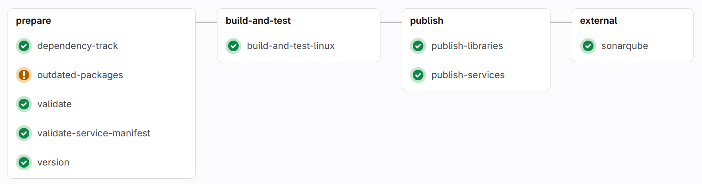
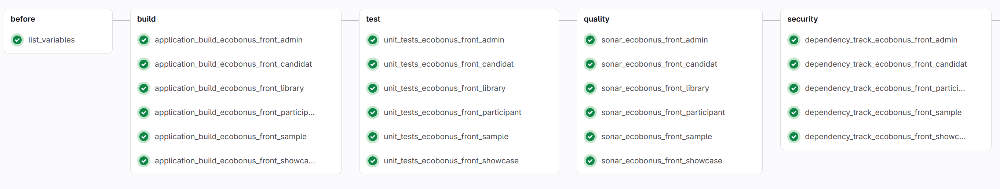
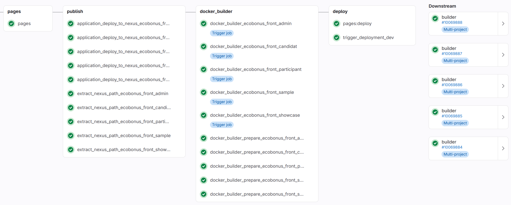

# Pipelines

Philippe Vlérick - philippe.vlerick@worldline.com

---

# Pourquoi un _pipeline_?

- c'est du _code_
- c'est répétable
- c'est identique ?

---

# Chez _Worldline_

## Portail Kazan

--- 

## Outils

- Sonar
- Dependency Track
- Nexus
- Jenkins

---

## Exemples

---

## Exemples

---

## Exemples

