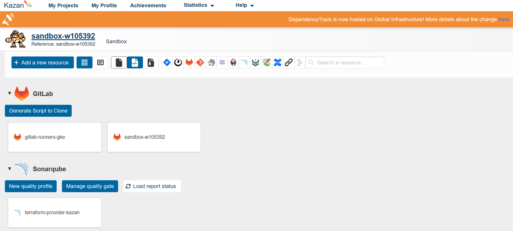

# Pipelines Workshop

## Philippe Vlérick - philippe.vlerick@worldline.com

---

# C'est quoi une _pipepine_: CI/CD

- CI: _Continuous Integration_
- CD: _Continuous Delivery_

---

## _Continuous Integration_

Intégration constante du travail de l'équipe

- build
- tests
- qualité
- ...

---

## _Continuous Delivery_

- déploiements constants

---

# Pourquoi une _pipeline_?

- c'est du _code_
- c'est répétable
- c'est appliqué à tout changement, aussi insignifiant qu'il puisse paraitre
- aucune intervention manuelle

## => Réduction du risque

---

# S'applique au code applicatif, mais pas que...

- bases de données
  - Liquibase
  - DacPac
- infrastructure
  - Terraform

--- 

# Chez _Worldline_

## Portail Kazan

--- 

## Outils

- Sonar
- Dependency Track
- Nexus
- Jenkins

---

## Quelques Pipelines...

- code applicatif
- infrastructure

---
layout: cover
background: ./img/pipeline.jpg
---

# Workshop
## https://gitlab.com/pvlerick/pipeline-demo
